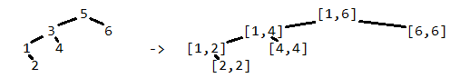

# Подготовка за изпит

## Изпит по ФП, 2017/2018

**Задача 1**  

Път от корен до възел в двоично дърво кодираме с поредица от цифри 0 и 1, която започва с цифрата 1, а за всяка следваща цифра 0 означава завиване по левия клон, а 1 — по десния. Да се реализира функция `sameAsCode`, която в двоично дърво от числа връща такова число x, което съвпада по стойност с двоичното число, кодиращо пътя от корена до x, или 0, ако такова число няма. Представянето на дървото е по ваш избор.

```scheme
(sameAsCode '(5 (3 () (2 () ())) (4 (6 () ()) ()))      ;; връща 6
```

**Задача 2**  

Даден е списък от n списъци от числа l1, …, ln и списък от n функции f1, …, fn. Да се реализира функция `aProg`, която връща списък x1, …, xn, където xi ∈ li и f1(x1), f2(x2), ... fn(xn) образуват аритметична прогресия. В случай, че такива xi не съществуват, функцията да връща празния списък.

```haskell
ghci> aProg [[1,2], [3,4], [5,7]] [(+3), id, (7-)]  -- връща  [1, 3, 5]
```

**Задача 3**  

Лекарство се задава със наредена двойка от име (низ) и списък от активни съставки, зададени като наредени двойки от име (низ) и количество в мг (цяло число). Казваме, че лекарството A е заместител на лекарството B, ако A има точно същите активни съставки като B в същата пропорция.
a) Да се реализира функция isSubstitute, която по две дадени лекарства проверява дали едното е заместител на другото.
б) Да се реализира функция bestSubstitutes, която по лекарство A и списък от лекарства L намира името на "най-добрия" заместител на A в L, чиито активни съставки са най-близки по количество до тези на A, без да ги надхвърлят, или празният низ, ако такъв няма.
в) Да се реализира функция groupSubstitutes, по даден списък от лекарства ги групира по “заместителство”, т.е. връща списък от списъци от лекарства, където всички лекарства в даден списък са заместители един на друг.

```haskell
main = do
    let
      l = [("A",[("p",6),("q",9)]),("B",[("p",2),("q",3)]),("C",[("p",3)])]
    print $ isSubstitute (l!!0) (l!!1)        -- връща True
    print $ bestSubstitute (l!!0) (tail l)    -- връща "B"
    print $ groupSubstitutes l                -- връща [[("A",...),("B",...)],[("C",...)]]
```

## Изпит по ФП, 2016/2017

**Задача 1**

Да се напише функция `largestInterval`, която получава като аргументи две едноместни целочислени функции f и g и две цели числа a и b.  
Функцията трябва да намира най-големия целочислен подинтервал на [a, b] такъв, че двете функции дават еднакви стойности за всяко цяло число в него.

```haskell
ghci > largestInterval (\x -> x) (\x -> x*x) 0 3    -- връща (0, 1)
```

**Задача 2**

Да се напише функция `intervalTree`, която преобразува двоично дърво от числа в ново дърво със същата структура, в което стойността във всеки възел е заменена с наредена двойка, представляваща най-малкия интервал, съдържащ всички стойности в съответното поддърво. Представянето на дървото е по ваш избор.



**Задача 3**

Да се генерира поток `sumsOfSquares` от тези числа, които са сума от квадратите на две положителни цели числа.

**Задача 4**

Видеоклип се представя с име (низ) и дължина (брой секунди). Да се напише функция `averageVideo`, която по непразен списък от видеоклипове намира името на този, който е с дължина най-близка до средната дължина на всички видеоклипове в списъка, без да я надхвърля.

```haskell
ghci> averageVideo [("lolcat", 15), ("dogewow", 35), ("omgseethis", 28)]    -- връща "lolcat"
```

## Изпит по ФП, 2015/2016
