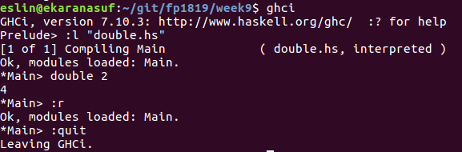
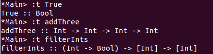

# Week 9

## [Learn You a Haskell for Great Good!](http://learnyouahaskell.com/chapters)

## [Haskell компилатор](https://www.haskell.org/platform/)

Haskell файловете завършват на `.hs`.  
GHC може да компилира haskell код, но също така позволява интерактивно да боравим с код в конзолата.



- с `ghci` стартираме interactive mode
- с `:l "double.hs"` зареждаме файла `double.hs`, който се намира в същата папка, и правим всички дефинирани в него функции достъпни в конзолата (в този случай, тя е една - `double`)
- ако променим нещо в `double.hs`, можем да презаредим файла с `:r`
- с `:quit` излизаме от `ghci`

## [Hoogle or Haskell Google](https://www.haskell.org/hoogle/)

Тук можем да търсим вградени функции по името или типа им.

## [Индентация](https://en.wikibooks.org/wiki/Haskell/Indentation)

## Коментари

- single-line коментари  
```haskell
  -- Magic. Do not touch.
```

- multiline коментари  
```haskell
  {-
    somedev1 -  6/7/02 Adding temporary tracking of Login screen
    somedev2 -  5/22/07 Temporary my ass
  -}
  ```

## Типове данни

Haskell е `статично типизиран език` (типът на всеки израз е известен по време на компилация) с `извод на типовете` (в общия случай не е нужно ние да ги задаваме).

#### `Int`, `Integer`
  - `Int` има минимална и максимална стойност, `Integer` - не, сътоветно може да бъде използван за много големи числа
  - `+`, `-`, `*`, `/`, `==`, `/=`, `>`, `<`, `>=`, `<=`, `min`, `max`, `succ`, `pred`, `div`, `mod`, `even`, `odd`

#### `Float`, `Double`

#### `Bool`
  - със стойности `True` и `False`
  - `&&`, `||`, `not`

#### `Char`
  - използваме единични кавички - `'a'`, `'b'`
  - `succ`, `pred`

#### `String` - или `[Char]`
  - използваме двойни кавички - `"floccinaucinihilipilifications"`

#### списък
  - хомогенна структура от данни
  - `[Int]` - тип списък от `Int`
  - `[Bool]` - тип списък от `Bool`, etc
  -  `:`, `++`, `!!`, `head`, `tail`, `last`, `init`, `length`, `null`, `reverse`, `take`, `drop`, `maximum`, `minimum`, `sum`, `product`, `elem`, `zip`, `==`, `/=`

#### наредена двойка / tuple / кортеж?
  - хетерогенна структура от данни
  - `()` - тип празен tuple / кортеж?
  - `(Int)` - тип tuple / кортеж? с един елемент от тип `Int`
  - `(Int, Int)` - тип наредена двойка / tuple / кортеж? с два елемента, първият от които е от тип `Int`, втория - също, etc
  - `fst`, `snd`

Функциите също имат типове. Kогато дефинираме функция можем изрично да декларираме от какъв тип е, което се смята за добра практика, освен в случаите на много кратки функции.

```haskell
addThree :: Int -> Int -> Int -> Int  
addThree x y z = x + y + z  

filterInts :: (Int -> Bool) -> [Int] -> [Int]
filterInts _ [] = []
filterInts pred (x:xs) = if pred x
                          then x : (filterInts pred xs)
                          else (filterInts pred xs)
```

Можем да видим от какъв тип е нещо в интерактивен режим като използваме
`:t нещо`.  
Четем `::` като `от тип`.




## Дефиниции и прилагане на функции

Използваме space за да приложим функция над дадени аргументи.  
Прилагането на функция е операцията с най-висок приоритет.

```haskell
ghci> max 5 4 + 2  
7
ghci> max 5 (4 + 2)  
6
```

За да дефинираме функция изреждаме името на функцията, аргументите, които приема, последвани от `=` и тялото на функцията.

```haskell
double x = x + x

favouriteAnimal = "doggo"
```

## Currying и частично прилагане на функции

Всяка функция в Haskell всъщност приема само един аргумент.  
Как тогава пишем функции над няколко аргумента?  
Всички, функции, които приемат повече от един аргумент, всъщност са curried функции.

```haskell
ghci> max 4 5  
5  
ghci> (max 4) 5   -- изцяло еквивалентно на горното извикване
5  
```

`max 4 5` първо създава функция, която приема един параметър и връща по-голямото число сред (4, онзи параметър). След това тази функция е приложена над аргумента 5.

TODO add more info

## Pattern Matching

Когато дефинираме функции, можем да изпълним различно тяло на функцията, в зависимост от това с какви аргументи е била извикана.  
Pattern match-ваме отгоре-надолу.

```haskell
factorial :: Int -> Int  
factorial 0 = 1     -- дъно на рекурсията, ако подаденият ни аргумент е 0
factorial n = n * factorial (n - 1)        -- рекурсивно извикване, иначе
```

```haskell
addVectors :: (Double, Double) -> (Double, Double) -> (Double, Double)  
addVectors a b = (fst a + fst b, snd a + snd b)

{-
  чрез pattern matching можем да "деконструираме"/"разпарчетосаме"
  входните данни
-}
addVectors' :: (Double, Double) -> (Double, Double) -> (Double, Double)  
addVectors' (a1, a2) (b1, b2) = (a1 + b1, a2 + b2)
```

## Гардове

Докато чрез `pattern matching` се увверяваме, че някоя стойност е от определен вид, с гардове проверяваме дали стойността изпълнява дадено условие (подобно на `if`).

```haskell
max' :: Int -> Int -> Int
max' a b
  | a > b = a
  | otherwise = b  
```

## Условни изрази

Условините изрази са ... изрази - т.е. връщат стойност.

#### if-then-else

```haskell
max' :: Int -> Int -> Int
max' a b = if a > b  
             then a   
             else b   -- else частта е задължителна
-- изразите, които връщат then и else трябва да са от един и същи тип
```

#### case

```haskell
describeList :: [Int] -> String  
describeList xs = "The list is " ++ case xs of [] -> "empty."  
                                               [x] -> "a singleton list."   
                                               xs -> "a longer list."
-- изразите, които връща всяка клауза, трябва да са от един и същи тип
```

## `let` и `where`

#### `let`

`let` дефинира израз (т.е. връща стойност) и се използва за локално дефиниране на променливи и функции.

```haskell
cylinder :: Double -> Double -> Double  
cylinder r h =
    let sideArea = 2 * pi * r * h  
        topArea = pi * r ^2  
    in  sideArea + 2 * topArea  
```

#### `where`

```haskell
bmiTell :: Double -> Double -> String  
bmiTell weight height  
    | bmi <= 18.5 = "You're underweight, you emo, you!"  
    | bmi <= 25.0 = "You're supposedly normal. Pffft, I bet you're ugly!"  
    | otherwise   = "You're fat! Lose some weight, fatty!"
    where bmi = weight / height ^ 2
```

Можем да поставим `where` след гардове, в който да дефинираме променливи и функции, които са видими във всички гардове.

```haskell
initials :: String -> String -> String  
initials firstname lastname = [f] ++ ". " ++ [l] ++ "."  
  where (f:_) = firstname  
        (l:_) = lastname    
```

Променливите и функциите, дефинирани в `where` не се споделят между различните тела на дадена функция (при pattern matching).

#### `let` vs `where`

`let ... in ...` е израз, т..е можем да го използваме навсякъде, където можем да ползваме изрази.

```haskell
ghci> 4 * (let a = 9 in a + 1) + 2  
42
```

`where` формата е свързана със заобикалящата я синтактична конструкция, като примерно pattern matching реда от дефиницията на функцията.

## Задачи

1. Дефинирайте функция `factorial number`, която връща `number!`

2. Дефинирайте функция `doubleFactorial number`, която изчислява `number!!` - произведението на всички числа, по-малки или равни на number, със същата четност

  ```haskell
  doubleFactorial 5      -- връща 15
  doubleFactorial 10     -- връща 3840
  ```

3. Дефинирайте функция `fibonacci n`, която връща `n`-тото число на Фибоначи

4. Дефинирайте функция `sum' start end`, която намира сумата да всички целочислени числа в интервала `[sum, end]`

5. Дефинирайте функция `sumEven a b`, която намира сумата на всички четни числа в интервала `[a, b]`

6. Дефинирайте функция `reverse' number`, която "обръща" дадено число

7. Дефинирайте функция `sumDivisors number`, която намира сумата от делителите да дадено число

8. Дефинирайте предикат `palindrome number`, който проверява дали дадено чило е палиндром

9. Дефинирайте предикат `prime number`, който проверява дали дадено число е просто

10. Дефинирайте предикат `coprime number1 number2`, която проверява дали `number` и `number2` са взаимнопрости (т.е. най-големият им общ делител е 1)

11. Хипотезата на Голдбах е, че

  > Всяко четно цяло число по-голямо от 2 може да бъде изразено като сбор от две прости числа.

  Дефинирайте функция `goldbach number`, която намира двете прости числа, чиято сума е `number`

  ```haskell
  ghci> goldbach 28
  (5 23)
  ```

12. Функцията на Ойлер се дефинира като

  > φ(n) = броя на естествените числа, ненадминаващи n и взаимно прости с n

  Дефинирайте функция `euler number`, която прилага функцията на Ойлер над `number`

  ```haskell
  ghci> euler 8
  4   -- защото нечетните числа 1, 3, 5 и 7 са взаимно прости с 8
  ```
